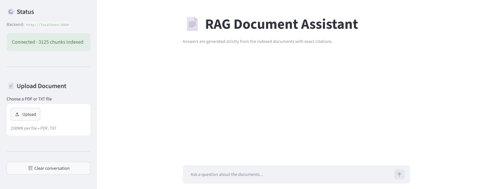

# RAG-Powered Document Assistant

A retrieval-augmented question answering system over a collection of product manuals.
Ask a question in plain language and get an answer built **only** from the indexed
documents, with the source file and page number cited next to it.

If the documents do not contain the answer, the assistant says so instead of guessing.



---


## Architecture

```
┌────────────────────────────────────┐
                 │  notebooks/rag_pipeline.ipynb      │
PDFs ────────────▶│  load → clean → chunk → embed      │
data/raw_docs/    │  evaluate → persist                │
└────────────────┬───────────────────┘
│  writes once
▼
backend/data/vector_store2/   (Chroma, on disk)
│
│  loaded once at startup (lifespan)
▼
┌───────────────┐   POST /query  ┌──────────────────┐   prompt   ┌──────────────┐
│  Streamlit    │ ─────────────▶ │  FastAPI backend │ ─────────▶ │  Cloud LLM   │
│  frontend     │ ◀───────────── │  retrieve + build│ ◀───────── │  API         │
│  :8501        │  answer +      │  grounded prompt │   answer   │  (e.g. Groq) │
└───────────────┘  sources       └──────────────────┘            └──────────────┘
```

**Flow:** question → embed → top-k cosine search in Chroma → numbered passages injected
into the prompt → LLM API generates a cited answer → answer + sources returned as JSON.

## Tech stack

| Layer | Choice |
|---|---|
| Embeddings | `sentence-transformers/all-MiniLM-L6-v2` (384-dim, CPU)[cite: 7] |
| Vector store | Chroma (`PersistentClient`, cosine distance) |
| LLM | Cloud LLM API (Groq / qwen/qwen3.8-27b, temperature 0.1)[cite: 7] |
| Backend | FastAPI + Pydantic v2, pytest + TestClient |
| Frontend | Streamlit |
| PDF parsing | pypdf |

## Project structure

```
rag-assistant-project/
├── notebooks/rag_pipeline.ipynb    # build + evaluate the pipeline
├── data/raw_docs/                  # source PDFs (git-ignored)
├── backend/
│   ├── app/
│   │   ├── main.py                 # FastAPI app, CORS, lifespan loading
│   │   ├── api/routes/query.py     # GET /health, POST /query
│   │   ├── core/config.py          # settings from .env
│   │   ├── schemas/query.py        # QueryRequest / QueryResponse
│   │   ├── services/retrieval.py   # load store, retrieve chunks
│   │   ├── services/generation.py  # prompt + LLM API call
│   │   └── utils/logging_config.py
│   ├── data/vector_store2/         # copied from the notebook (git-ignored)
│   ├── tests/test_query.py
│   ├── requirements.txt / .env.example / Dockerfile
└── frontend/
├── app.py / api_client.py / requirements.txt / .env.example
```

## Domain & data

The corpus consists of **15 consumer product manuals** (washing machines, routers, cameras)
downloaded from manufacturer support sites — **15 PDFs, 1,607 pages**. They are native
digital PDFs, so text extraction needs no OCR; **14** pages were blank/image-only and dropped.

The raw corpus is not committed (size + redistribution). To reproduce: download the
manuals listed in `docs/sources.md` into `data/raw_docs/` and run the notebook.

## Setup

### 0. Prerequisites

```bash
python --version      # 3.10+
```

### 1. Build the vector store

```Bash
python -m venv .venv
.venv\Scripts\activate            # Windows
# source .venv/bin/activate       # macOS / Linux

pip install jupyter pandas pypdf chromadb sentence-transformers tabulate
jupyter notebook notebooks/rag_pipeline.ipynb    # Kernel → Restart & Run All
```

The last cell writes the store to `backend/data/vector_store2/`.

### 2. Backend

```bash
cd backend
pip install -r requirements.txt
copy .env.example .env            # cp on macOS/Linux
uvicorn app.main:app --reload
```

Open http://localhost:8000/docs and try `/query` from Swagger UI.
Run the tests with `pytest` (4 tests, no Ollama needed — the services are faked).

### 3. Frontend

```bash
cd frontend
pip install -r requirements.txt
copy .env.example .env
streamlit run app.py               # http://localhost:8501
```

## Environment variables

### `backend/.env`

| Variable | Default | Purpose |
|---|---|---|
| `VECTOR_STORE_DIR` | `./data/vector_store2` | Persisted Chroma directory |
| `COLLECTION_NAME` | `manuals_v2` | Chroma collection name |
| `EMBEDDING_MODEL` | `sentence-transformers/all-MiniLM-L6-v2` | Must match the notebook |
| `TOP_K` | `8` | Passages retrieved per question |
| `LLM_PROVIDER` | `groq` | LLM service provider |
| `LLM_MODEL` | `qwen/qwen3.8-27b` | Generation model |
| `LLM_API_KEY` | `your_groq_api_key_here` | API authentication key |
| `ALLOWED_ORIGINS` | `http://localhost:8501,...` | CORS origins |
| `LOG_LEVEL` | `INFO` | Logging verbosity |

### `frontend/.env`

| Variable | Default | Purpose |
|---|---|---|
| `API_BASE_URL` | `http://localhost:8000` | Backend base URL |
| `API_TIMEOUT` | `120` | Request timeout (seconds) |

## API reference

### `GET /health`

```json
{"status":"ok","vector_store_loaded":true,"indexed_chunks":812,
 "llm_available":true,"model":"qwen/qwen3.8-27b"}
```

### `POST /query`

Request `{"question": "string, 3–1000 chars"}` · invalid input returns **422**.

```bash
curl -X POST http://localhost:8000/query \
  -H "Content-Type: application/json" \
  -d '{"question":"What temperature should cotton be washed at?"}'
```

```json
{
  "answer": "Cotton should be washed at 40 °C. [1]",
  "sources": ["samsung_ww90.pdf p.12"],
  "chunks": [
    {"label":"samsung_ww90.pdf p.12","document":"samsung_ww90.pdf",
     "page":12,"score":0.2134,"preview":"Cotton — 40 °C, max spin 1400 rpm..."}
  ],
  "model": "qwen/qwen3.8-27b",
  "elapsed_ms": 1840
}
```

| Code | Meaning |
|---|---|
| 200 | Answer returned |
| 422 | Question missing or shorter than 3 characters |
| 502 | LLM Provider unreachable |
| 503 | Vector store not loaded |

## Evaluation results

10 questions with known answers; 2 are deliberately out of scope to verify the assistant
refuses rather than answering from the LLM's own knowledge[cite: 6]. Full table:
`notebooks/evaluation_results.csv`.
Accuracy: 7 / 10 (70%)

[cite: 6]

| Question | Retrieved source | Answer | Correct |


**Main failure cases:** All 3 failure cases (rows 0, 1, and 5) stem from **LLM Over-Refusal** triggered by retrieval ranking noise. Although the retriever included relevant context (`context_relevant = True`), distracting chunks from other product manuals appeared ahead of the expected source file in the top-$k$ results. This noise caused the LLM to strictly apply its guardrail prompt and respond with *"I could not find this in the provided documents"* instead of extracting the answer from the lower-ranked relevant chunks.

## Screenshots


