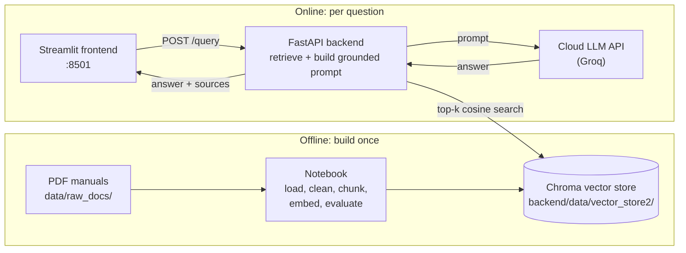
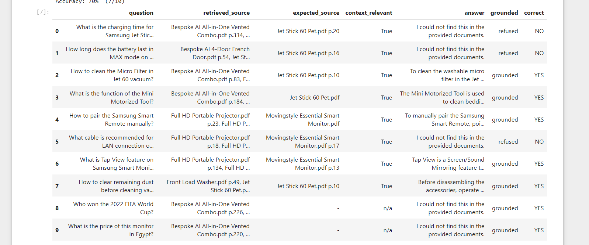
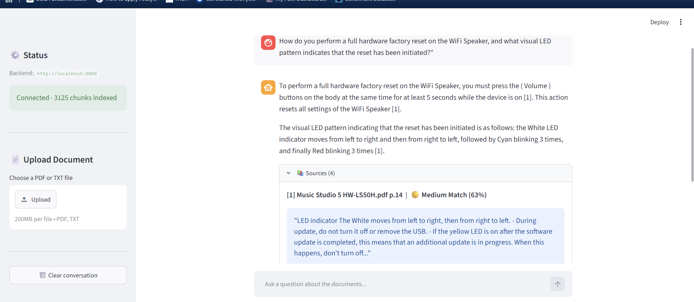

# RAG-Powered Document Assistant


A retrieval-augmented question answering system over a collection of product manuals.
Ask a question in plain language and get an answer built **only** from the indexed
documents, with the source file and page number cited next to it.

> If the documents do not contain the answer, the assistant says so instead of guessing.


---

## Table of contents

- [Key features](#key-features)
- [Architecture](#architecture)
- [Tech stack](#tech-stack)
- [Project structure](#project-structure)
- [Domain and data](#domain-and-data)
- [Setup](#setup)
- [Environment variables](#environment-variables)
- [API reference](#api-reference)
- [Example questions](#example-questions)
- [Evaluation results](#evaluation-results)
- [Screenshots](#screenshots)

---

## Key features

- **Grounded answers only** — the LLM is instructed to answer from retrieved passages, never from its own knowledge.
- **Verifiable citations** — every answer lists the source file and page number.
- **Honest refusals** — out-of-scope questions get "I could not find this in the provided documents".
- **Fast startup** — the vector store is loaded once when the API starts (FastAPI lifespan).
- **Tested backend** — pytest suite with faked services, so no API key or model download is needed to run it.

## Architecture



**Flow:** question → embed → top-k cosine search in Chroma → numbered passages injected
into the prompt → LLM generates a cited answer → answer + sources returned as JSON.

## Tech stack

| Layer | Choice |
|---|---|
| Embeddings | `sentence-transformers/all-MiniLM-L6-v2` (384-dim, CPU) |
| Vector store | Chroma (`PersistentClient`, cosine distance) |
| LLM | Cloud LLM API (Groq, `qwen/qwen3.8-27b`, temperature 0.1) |
| Backend | FastAPI + Pydantic v2, pytest + TestClient |
| Frontend | Streamlit |
| PDF parsing | pypdf |

## Project structure

```
rag-assistant-project/
├── notebooks/
│   └── rag_pipeline.ipynb          # build + evaluate the pipeline
├── data/
│   └── raw_docs/                   # source PDFs (git-ignored)
├── backend/
│   ├── app/
│   │   ├── main.py                 # FastAPI app, CORS, lifespan loading
│   │   ├── api/routes/query.py     # GET /health, POST /query
│   │   ├── core/config.py          # settings from .env
│   │   ├── schemas/query.py        # QueryRequest / QueryResponse
│   │   ├── services/retrieval.py   # load store, retrieve chunks
│   │   ├── services/generation.py  # prompt + LLM API call
│   │   └── utils/logging_config.py
│   ├── data/vector_store2/         # copied from the notebook (git-ignored)
│   ├── tests/test_query.py
│   ├── requirements.txt
│   ├── .env.example
│   └── Dockerfile
├── frontend/
│   ├── app.py
│   ├── api_client.py
│   ├── requirements.txt
│   └── .env.example
└── docs/
    ├── sources.md                  # where to download the manuals
    └── screenshot-chat.png
```

## Domain and data

The corpus consists of **15 consumer product manuals** (washing machines, routers, cameras)
downloaded from manufacturer support sites: **15 PDFs, 1,607 pages**. They are native
digital PDFs, so text extraction needs no OCR; **14** pages were blank or image-only and were dropped.

The raw corpus is not committed (size and redistribution). To reproduce it, download the
manuals listed in `docs/sources.md` into `data/raw_docs/` and run the notebook.

## Setup

### 0. Prerequisites

```bash
python --version      # 3.10+
```

You will also need a Groq API key (or another supported provider key) for the backend.

### 1. Build the vector store

```bash
python -m venv .venv
.venv\Scripts\activate            # Windows
# source .venv/bin/activate       # macOS / Linux

pip install jupyter pandas pypdf chromadb sentence-transformers tabulate
jupyter notebook notebooks/rag_pipeline.ipynb    # Kernel → Restart & Run All
```

The last cell writes the store to `backend/data/vector_store2/`.

### 2. Backend

```bash
cd backend
pip install -r requirements.txt
copy .env.example .env            # cp on macOS/Linux
# edit .env and set LLM_API_KEY
uvicorn app.main:app --reload
```

Open <http://localhost:8000/docs> and try `/query` from Swagger UI.

Run the tests with `pytest` (4 tests; no API key needed, the services are faked).

### 3. Frontend

```bash
cd frontend
pip install -r requirements.txt
copy .env.example .env            # cp on macOS/Linux
streamlit run app.py              # http://localhost:8501
```

## Environment variables

### `backend/.env`

| Variable | Default | Purpose |
|---|---|---|
| `VECTOR_STORE_DIR` | `./data/vector_store2` | Persisted Chroma directory |
| `COLLECTION_NAME` | `manuals_v2` | Chroma collection name |
| `EMBEDDING_MODEL` | `sentence-transformers/all-MiniLM-L6-v2` | Must match the notebook |
| `TOP_K` | `8` | Passages retrieved per question |
| `LLM_PROVIDER` | `groq` | LLM service provider |
| `LLM_MODEL` | `qwen/qwen3.8-27b` | Generation model |
| `LLM_API_KEY` | *(none, required)* | API key for the LLM provider. Never commit it |
| `ALLOWED_ORIGINS` | `http://localhost:8501,...` | CORS origins |
| `LOG_LEVEL` | `INFO` | Logging verbosity |

### `frontend/.env`

| Variable | Default | Purpose |
|---|---|---|
| `API_BASE_URL` | `http://localhost:8000` | Backend base URL |
| `API_TIMEOUT` | `120` | Request timeout (seconds) |

## API reference

### `GET /health`

```json
{
  "status": "ok",
  "vector_store_loaded": true,
  "indexed_chunks": 812,
  "llm_available": true,
  "model": "qwen/qwen3.8-27b"
}
```

### `POST /query`

Request body: `{"question": "string, 3–1000 chars"}`. Invalid input returns **422**.

```bash
curl -X POST http://localhost:8000/query \
  -H "Content-Type: application/json" \
  -d '{"question":"What should I do if the 5C code appears on the washer?"}'
```

Example response (abbreviated; scores and timings will vary):

```json
{
  "answer": "The 5C code points to a problem with the drain system. Make sure the drain filter is not clogged; if it is, clean the filter and then restart the washer. [1]",
  "sources": ["Front_Load_Washer.pdf p.56"],
  "chunks": [
    {
      "label": "Front_Load_Washer.pdf p.56",
      "document": "Front_Load_Washer.pdf",
      "page": 56,
      "score": 0.2134,
      "preview": "5C — Check the drain system. Make sure the drain filter is not clogged..."
    }
  ],
  "model": "qwen/qwen3.8-27b",
  "elapsed_ms": 1840
}
```

| Code | Meaning |
|---|---|
| 200 | Answer returned |
| 422 | Question missing or outside the 3–1000 character range |
| 502 | LLM provider unreachable |
| 503 | Vector store not loaded |

## Example questions

Questions that can be answered from the Samsung front-load washer manual (`WF50BG83**A*`):

| Question | Where the answer lives |
|---|---|
| What should I do if the 5C code appears on the washer? | Troubleshooting, p. 56 |
| How do I drain the washer after a power failure? | Emergency drain, p. 45 |

Out-of-scope questions (for example, "What is the capital of France?") should be refused.

## Evaluation results

The pipeline was tested with 10 questions that have known answers. Two of them are
deliberately out of scope, to verify that the assistant refuses instead of answering from
the LLM's own knowledge. The full table is in `notebooks/evaluation_results.csv`.

| Metric | Value |
|---|---|
| Questions | 10 |
| Out-of-scope (must refuse) | 2 |
| Correct answers | 7 |
| **Accuracy** | **70%** |



### Failure analysis

All 3 failures (rows 0, 1 and 5 of `evaluation_results.csv`) are **LLM over-refusals** caused by
retrieval ranking noise. The retriever did return the relevant context
(`context_relevant = True`), but chunks from other product manuals were ranked above the
expected source file in the top-k results. The distraction made the LLM apply its guardrail
prompt too strictly and answer *"I could not find this in the provided documents"* instead of
using the lower-ranked relevant chunks.

### Possible improvements

- Add a cross-encoder **re-ranker** on top of the vector search.
- Store the product name as chunk **metadata** and filter or boost by it.
- Tune `TOP_K` and the refusal wording in the prompt.

## Screenshots


